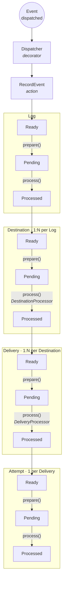
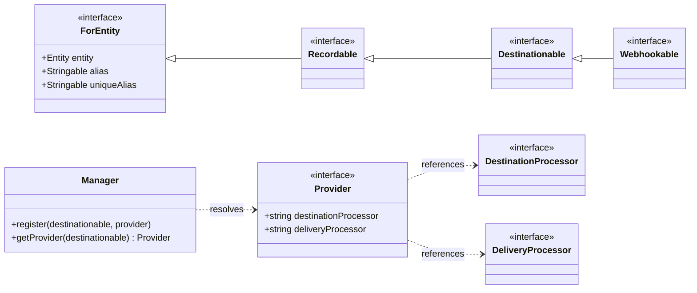

# Event Log

## Pipeline

```mermaid
flowchart TB
    Event(("Event<br/>dispatched"))
    --> Dispatcher["Dispatcher<br/><i>decorator</i>"]
    --> RecordEvent["RecordEvent<br/><i>action</i>"]
    --> LogReady

    subgraph Log ["Log"]
        LogReady["Ready"]
        -- "prepare()" --> LogPending["Pending"]
        -- "process()" --> LogProcessed["Processed"]
    end

    LogProcessed --> DestReady

    subgraph Destination ["Destination · 1:N per Log"]
        DestReady["Ready"]
        -- "prepare()" --> DestPending["Pending"]
        -- "process()<br/><i>DestinationProcessor</i>" --> DestProcessed["Processed"]
    end

    DestProcessed --> DelReady

    subgraph Delivery ["Delivery · 1:N per Destination"]
        DelReady["Ready"]
        -- "prepare()" --> DelPending["Pending"]
        -- "process()<br/><i>DeliveryProcessor</i>" --> DelProcessed["Processed"]
    end

    DelProcessed --> AttReady

    subgraph Attempt ["Attempt · 1 per Delivery"]
        AttReady["Ready"]
        -- "prepare()" --> AttPending["Pending"]
        -- "process()" --> AttProcessed["Processed"]
    end
```

### Contracts

```mermaid
classDiagram
    direction LR

    class Recordable {
        <<interface>>
    }
    class ForEntity {
        <<interface>>
        +Entity entity
        +Stringable alias
        +Stringable uniqueAlias
    }
    class Destinationable {
        <<interface>>
    }
    class Webhookable {
        <<interface>>
    }
    class Provider {
        <<interface>>
        +string destinationProcessor
        +string deliveryProcessor
    }
    class DestinationProcessor {
        <<interface>>
    }
    class DeliveryProcessor {
        <<interface>>
    }
    class Manager {
        +register(destinationable, provider)
        +getProvider(destinationable) Provider
    }

    ForEntity <|-- Recordable
    Recordable <|-- Destinationable
    Destinationable <|-- Webhookable

    Provider ..> DestinationProcessor : references
    Provider ..> DeliveryProcessor : references
    Manager ..> Provider : resolves
```
