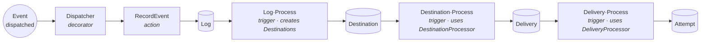
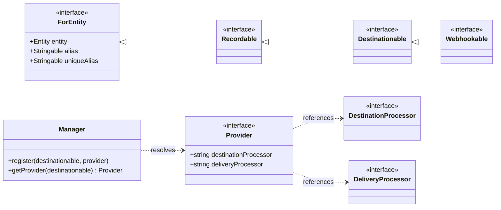

# Event Log

## Pipeline

```mermaid
flowchart LR
    Event(("Event<br/>dispatched"))
    --> Dispatcher["Dispatcher<br/><i>decorator</i>"]
    --> RecordEvent["RecordEvent<br/><i>action</i>"]
    --> Log[("Log")]
    --> LogProcess["Log·Process<br/><i>trigger · creates Destinations</i>"]
    --> Destination[("Destination")]
    --> DestProcess["Destination·Process<br/><i>trigger · uses DestinationProcessor</i>"]
    --> Delivery[("Delivery")]
    --> DelProcess["Delivery·Process<br/><i>trigger · uses DeliveryProcessor</i>"]
    --> Attempt[("Attempt")]
```

### Contracts

```mermaid
classDiagram
    direction LR

    class Recordable {
        <<interface>>
    }
    class ForEntity {
        <<interface>>
        +Entity entity
        +Stringable alias
        +Stringable uniqueAlias
    }
    class Destinationable {
        <<interface>>
    }
    class Webhookable {
        <<interface>>
    }
    class Provider {
        <<interface>>
        +string destinationProcessor
        +string deliveryProcessor
    }
    class DestinationProcessor {
        <<interface>>
    }
    class DeliveryProcessor {
        <<interface>>
    }
    class Manager {
        +register(destinationable, provider)
        +getProvider(destinationable) Provider
    }

    ForEntity <|-- Recordable
    Recordable <|-- Destinationable
    Destinationable <|-- Webhookable

    Provider ..> DestinationProcessor : references
    Provider ..> DeliveryProcessor : references
    Manager ..> Provider : resolves
```
