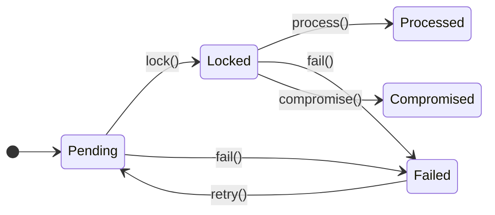
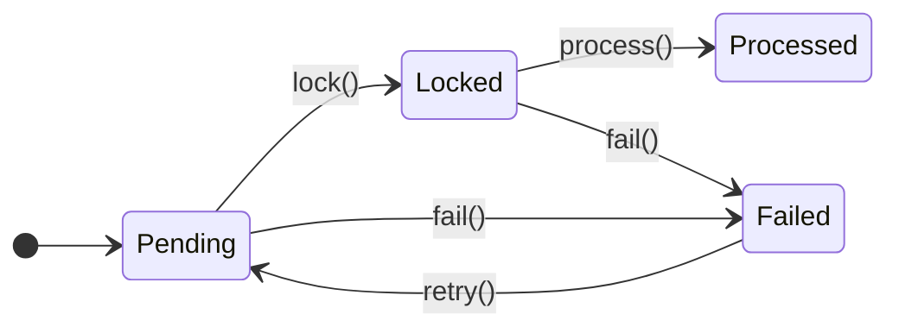
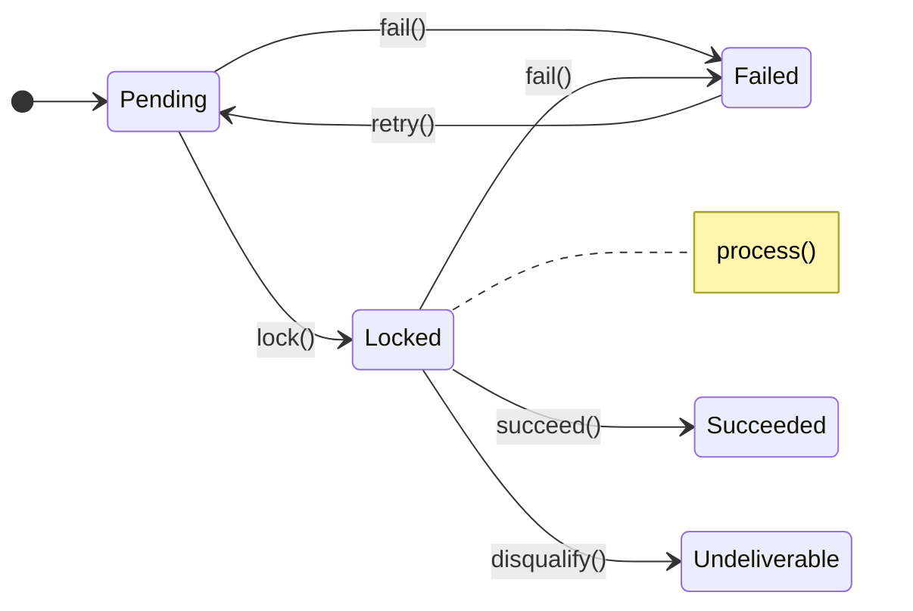
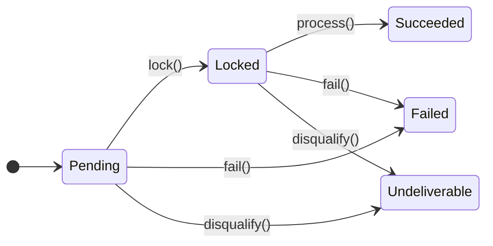

# State Machines

Every tier's `status` is a backed string enum built on
`aryeo/eloquent-state-machines`. Each enum implements `StateMachineable` and uses
`ManagesState`. For the surrounding pipeline, see [lifecycle.md](lifecycle.md).
For a top-down overview, start at [README.md](README.md).

A trigger is the object that performs one transition. Each transition names its
trigger. When you call a magic method like `lock()` or `process()`, you get a
fully-populated trigger. You then run it with `->now()` (synchronous) or
`->dispatch()` (queued).

## How transitions are declared

Each `Status` enum uses per-case attributes:

- `#[Events(before:, after:)]` — the event dispatched before the record enters a
  state (an "-ing" verb) and after it enters (an "-ed" verb).
- `#[Transition(to:, using:)]` (repeatable) — one outbound transition and the
  `Trigger` class that performs it.

The magic methods resolve through `ManagesState::__call`. It matches the method
name against the camelCased basename of each transition's `using` class. It
returns `$transition->using::make(...)->to($transition->to)->on($model)`. So a
trigger always has its target model and destination state before you run it.

## Transition tables

### Log

| From | To | Trigger |
|---|---|---|
| Pending | Locked | `Lock` |
| Pending | Failed | `Fail` |
| Locked | Processed | `Process` |
| Locked | Compromised | `Compromise` |
| Locked | Failed | `Fail` |
| Failed | Pending | `Retry` |

### Relay

Identical shape to Log minus `Compromised` — states `Pending`, `Locked`,
`Processed`, `Failed`; triggers `Lock`, `Process`, `Fail`, `Retry`.

### Delivery

| From | To | Trigger |
|---|---|---|
| Pending | Locked | `Lock` |
| Pending | Failed | `Fail` |
| Locked | Locked (self) | `Process` |
| Locked | Succeeded | `Succeed` |
| Locked | Failed | `Fail` |
| Locked | Undeliverable | `Disqualify` |
| Failed | Pending | `Retry` |

The `Locked → Locked` self-transition via `Process` is deliberate: `Process` runs
while the record is already `Locked`, then itself drives `succeed()` /
`disqualify()` / `fail()` to a terminal state.

### DeliveryAttempt

| From | To | Trigger |
|---|---|---|
| Pending | Locked | `Lock` |
| Pending | Failed | `Fail` |
| Pending | Undeliverable | `Disqualify` |
| Locked | Succeeded | `Process` |
| Locked | Failed | `Fail` |
| Locked | Undeliverable | `Disqualify` |

DeliveryAttempt has **no `Retry`** (retry is owned by the parent Delivery), and
its `Process` goes straight `Locked → Succeeded`.

## Trigger base mechanics

`Trigger` (in `aryeo/eloquent-state-machines`) is abstract and uses `AsAction`. It
defaults to `#[TransitionDuring(Phase::After)]`. Its `lifecycle()` wraps
`before() → handle() → after()` in a `DB::transaction()` (unless the trigger has
`#[WithoutTransaction]`). On a throw it rescues a `model->refresh()` and re-throws.
`before()` guards `allowed()`, dispatches the before-event, and (for a
`Phase::Before` trigger) performs the state write. `after()` writes the state and
dispatches the after-event, unless the job failed or released.

Two guards protect a transition at execution time. Both run on the worker, so they
protect a queued job as well as a synchronous one.

- **`preventInvalidTransition`** — the redelivery guard. It compares the persisted
  state (`getRawOriginal`) against the expected `$from`. If the record has already
  advanced, the trigger throws `Invalid` before `handle()` runs. So a redelivered
  process step on a record that already moved on does nothing.
- **`changesState`** — the no-op guard. It compares the persisted state against
  `$to`. When the record is already in the target state, the before-event, the
  after-event, and the status write are all skipped.

### Attribute glossary

- `#[TransitionDuring(Phase::Before)]` — write the target state before `handle()`
  runs. The record is already in the new state during handling. The default is
  `Phase::After`.
- `#[WithoutTransaction]` — skip the `DB::transaction()` wrapper.
- `dispatchAfterFailed()` — a fluent call chained at the call site, not an
  attribute. If the trigger throws while it runs synchronously, re-queue it once.
  This stops a record from being stranded mid-lifecycle.
- `middleware()` — returns a `WithoutOverlapping` lock keyed to the record (only on
  the three queued `Process` triggers). See
  [architecture.md](architecture.md#concurrency-one-worker-per-record).

Every trigger also carries a `$queue` property hook that reads its target model's
`$queue` (see [architecture.md](architecture.md#per-layer-queue-resolution)). So
whichever trigger is dispatched lands on its layer's queue. The tables below omit
it because it is the same on every trigger.

## Per-trigger detail

### Logs

| Trigger | `handle()` | `failed()` | Invoked | Attributes / props |
|---|---|---|---|---|
| `Lock` | `process()->dispatch()->afterCommit()` | → `fail()->dispatchAfterFailed()->now()` | `->now()` from InitiateLifecycle | `#[TransitionDuring(Before)]` |
| `Process` | if event is a `Transport`, `firstOrCreate` a `Relay` per `event->transports` (keyed on `transport`) | Corrupted/Tampered → `compromise()`, else `fail()` (via `dispatchAfterFailed()`) | `->dispatch()` | `$tries=3`, `$backoff=[5,25]`; `middleware()` returns `WithoutOverlapping` per record |
| `Compromise` | empty | none | `->now()` w/ `dispatchAfterFailed()` | `$tries=3`, `$backoff=[5,25]` |
| `Fail` | empty | none | `->now()` w/ `dispatchAfterFailed()` | `$tries=3`, `$backoff=[5,25]` |
| `Retry` | `lock()->now()` | none | manual | `#[TransitionDuring(Before)]` |

### Relays

| Trigger | `handle()` | `failed()` | Invoked | Attributes / props |
|---|---|---|---|---|
| `Lock` | `process()->dispatch()->afterCommit()` | → `fail()->dispatchAfterFailed()->now()` | `->now()` from InitiateLifecycle | `#[TransitionDuring(Before)]` |
| `Process` | reflect `#[Dispatches]` (throw `NotDefined` if absent) + `#[Tries]`; build the collecting event; `event()`; `firstOrCreate` a `Delivery` per envelope (keyed on the envelope identity). The `Dispatches` constructor validates that the collecting class implements `NeedsEnvelopes`. | → `fail()->dispatchAfterFailed()->now()` | `->dispatch()` | `$tries=3`, `$backoff=[5,25]`; `middleware()` returns `WithoutOverlapping` per record |
| `Fail` | empty | none | `->now()` w/ `dispatchAfterFailed()` | `$tries=3`, `$backoff=[5,25]` |
| `Retry` | `lock()->now()` | none | manual | `#[TransitionDuring(Before)]` |

### Deliveries

| Trigger | `handle()` | `failed()` | Invoked | Attributes / props |
|---|---|---|---|---|
| `Lock` | `process()->dispatch()->afterCommit()` | → `fail()->dispatchAfterFailed()->now()` | `->now()` from InitiateLifecycle | `#[TransitionDuring(Before)]` |
| `Process` | `touch()`; if `!is_deliverable` → `disqualify()`; else `attempts()->create()` (catch `Undeliverable` → `disqualify()`); else `succeed()` (all via `dispatchAfterFailed()->now()`) | `Undeliverable` → disqualify, else fail (all via `dispatchAfterFailed()`) | `->dispatch()` | `#[WithoutTransaction]`; dynamic `tries` (= `delivery->tries - attempts_count`) and `backoff` (`5**n`); `middleware()` returns `WithoutOverlapping` per record |
| `Succeed` | empty | none | `->now()` w/ `dispatchAfterFailed()` | `$tries=3`, `$backoff=[5,25]` |
| `Fail` | empty | none | `->now()` w/ `dispatchAfterFailed()` | `$tries=3`, `$backoff=[5,25]` |
| `Disqualify` | empty | none | `->now()` w/ `dispatchAfterFailed()` | `$tries=3`, `$backoff=[5,25]` |
| `Retry` | `increment('tries')` then `lock()->now()` | none | manual | `#[TransitionDuring(Before)]` |

### DeliveryAttempts

| Trigger | `handle()` | `failed()` | Invoked | Attributes / props |
|---|---|---|---|---|
| `Lock` | `process()->now()` (no queue boundary) | writes `response`, then `Undeliverable` → disqualify, else fail (via `dispatchAfterFailed()`) | `->now()` from InitiateLifecycle | `#[TransitionDuring(Before)]`, `#[WithoutTransaction]` |
| `Process` | reflect `#[Dispatches]`, build the sending event; `event()`; if `result !== null`, `update(['response' => result])`. The `Dispatches` constructor validates that the sending class implements `NeedsSent`. | writes `response`, then `Undeliverable` → disqualify else fail (via `dispatchAfterFailed()`) | `->now()` | `#[WithoutTransaction]` |
| `Fail` | empty | none | `->now()` w/ `dispatchAfterFailed()` | `$tries=3`, `$backoff=[5,25]` |
| `Disqualify` | empty | none | `->now()` w/ `dispatchAfterFailed()` | `$tries=3`, `$backoff=[5,25]` |

### Why terminal triggers use `dispatchAfterFailed()`

`Fail`, `Disqualify`, `Succeed`, and `Compromise` have empty `handle()` bodies and
no `failed()` hook. They are pure state-writes. Another trigger's handler or
`failed()` hook reaches them with `->now()`. Those call sites chain
`dispatchAfterFailed()`. So if such a synchronous transition throws (for example, a
transient DB failure), it re-queues once and the record is not stranded in
`Locked`. `$tries` and `$backoff` bound the retries, so a permanent failure
dead-letters instead of looping.

`Process` and `Lock` are deliberately not invoked that way. They already have
`failed()` hooks. Pairing a `failed()` hook with `dispatchAfterFailed()` would
double-handle the failure — it would re-queue and run the hook.

The watchdog is the final backstop under all of this. Anything that still ends up
stuck in `Pending` or `Locked` past the grace period gets swept to `Failed`. See
[lifecycle.md](lifecycle.md#the-watchdog).

## Lifecycle diagrams

These blocks are regenerated by `php artisan state-machine:diagram --update`;
edit the state machines, not the rendered Mermaid.

<!-- diagram:Support\Events\Log\Logs\Status\Status:start -->
**`Support\Events\Log\Logs\Status\Status`**

<!-- diagram:Support\Events\Log\Logs\Status\Status:end -->
<!-- diagram:Support\Events\Log\Relays\Status\Status:start -->
**`Support\Events\Log\Relays\Status\Status`**

<!-- diagram:Support\Events\Log\Relays\Status\Status:end -->
<!-- diagram:Support\Events\Log\Deliveries\Status\Status:start -->
**`Support\Events\Log\Deliveries\Status\Status`**

<!-- diagram:Support\Events\Log\Deliveries\Status\Status:end -->
<!-- diagram:Support\Events\Log\DeliveryAttempts\Status\Status:start -->
**`Support\Events\Log\DeliveryAttempts\Status\Status`**

<!-- diagram:Support\Events\Log\DeliveryAttempts\Status\Status:end -->
